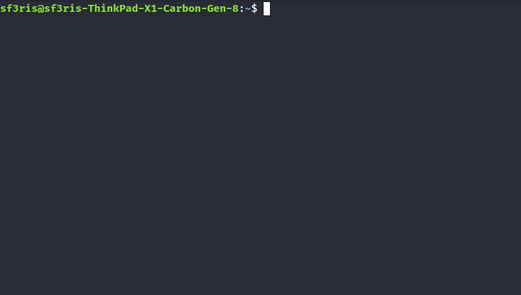

# TODUX
> Simple CLI todo manager


## Commands list

### Add item
````
$ todux add "Schedule new meeting for tomorrow at 10.30"

"Schedule new meeting for tomorrow at 10.30" added ✔

````

### Display list
````
$ todux list
````
Interactive keybindings during list view:
* [T] Toggle/Untoggle item
* [D] Delete item
* [Q] Quit app

### Change workspace
````
$ todux workspace set new_workspace

Workspace set to "new_workspace" ✔
````

### Unset workspace
````
$ todux workspace unset
````

### Delete workspace
````
$ todux workspace remove new_workspace

Workspace "new_workspace" removed 🗑
````


